# 第一章实验报告

## 实验目的

+ 熟悉基于 OpenWrt 的无线接入点（AP）配置
+ 为第二章、第三章和第四章实验准备好「无线软 AP」环境

## 实验要求

+ [x] 对照 [第一章 实验](https://c4pr1c3.github.io/cuc-mis/chap0x01/exp.html) `无线路由器/无线接入点（AP）配置` 列的功能清单，找到在 OpenWrt 中的配置界面并截图证明；
+ [x] 记录环境搭建步骤；
+ [x] 如果 USB 无线网卡能在 `OpenWrt` 中正常工作，则截图证明。
如果 USB 无线网卡不能在 OpenWrt 中正常工作，截图并分析可能的故障原因并给出可能的解决方法。


## 实验环境

+ 可以开启监听模式、AP 模式和数据帧注入功能的 USB 无线网卡
+ Virtualbox


## 实验结果


+ 重置和恢复AP到出厂默认设置状态
  （手贱点了重置之后真的从头再来了一遍：））

  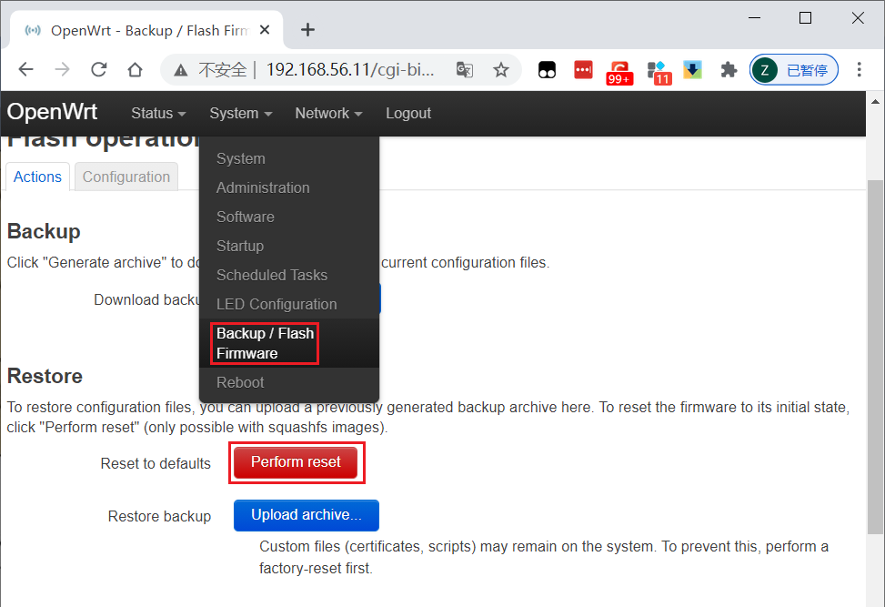

  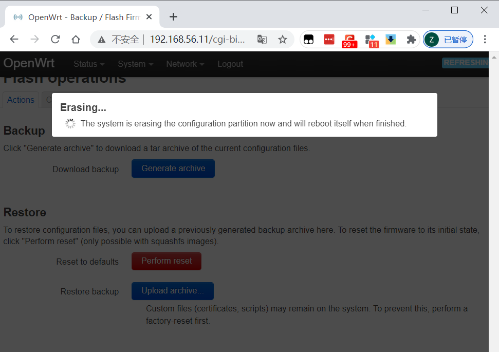

+ 设置AP的管理员用户名和密码

  

+ 设置SSID广播和非广播模式
  + 勾选`Hide ESSID`为非广播模式，不勾选为广播模式。

  

+ 配置不同的加密方式

  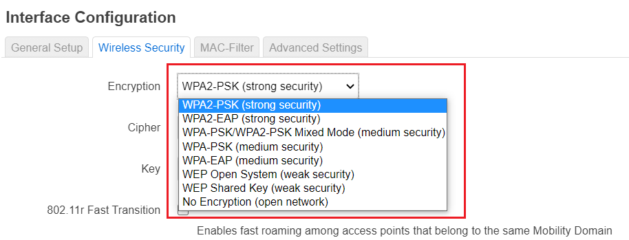

+ 设置AP管理密码

  

+ 配置无线路由器使用自定义的DNS解析服务器

  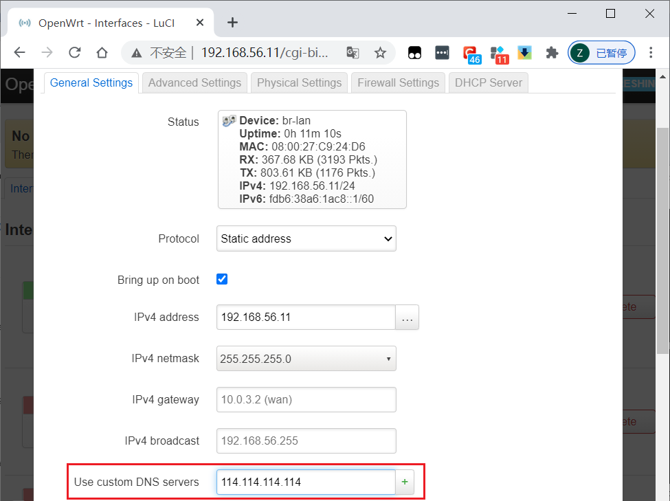

+ 配置DHCP和禁用DHCP

  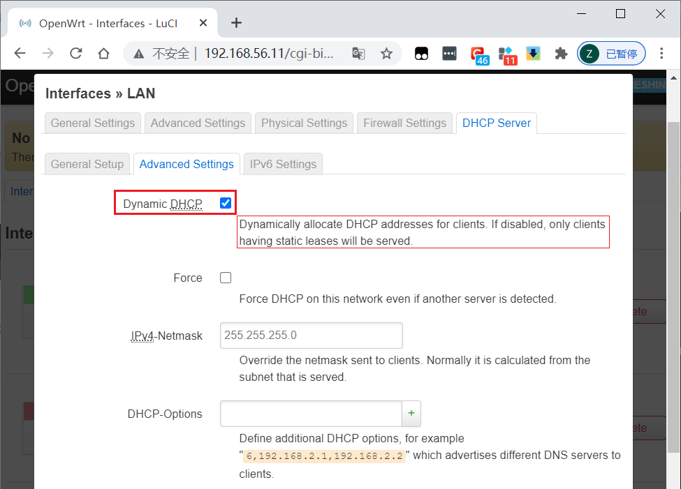

+ 开启路由器/AP的日志记录功能（对指定事件记录）

  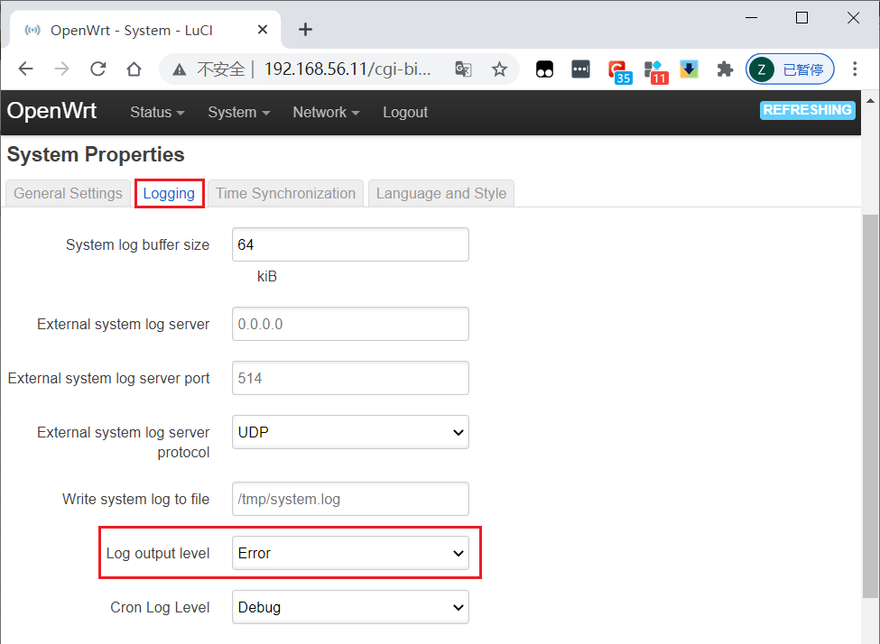

+ 配置AP隔离(WLAN划分)功能

  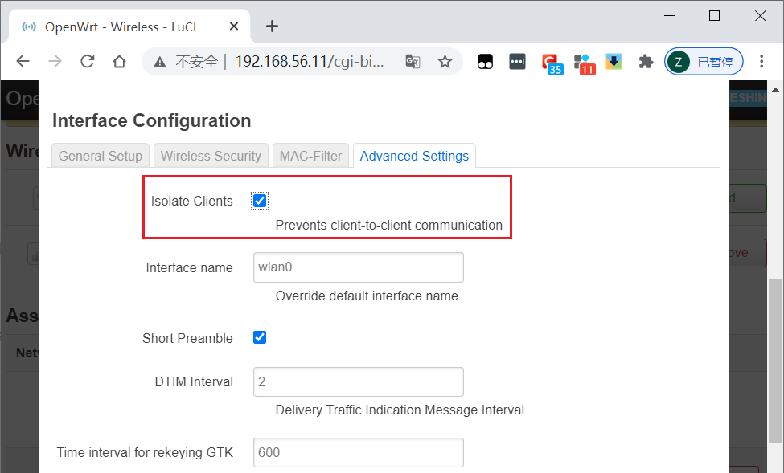

+ 设置MAC地址过滤规则（ACL地址过滤器）

  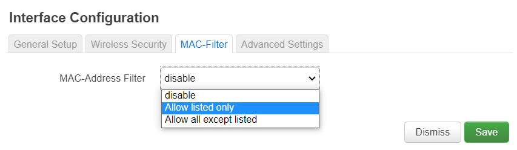

+ 查看WPS功能的支持情况

  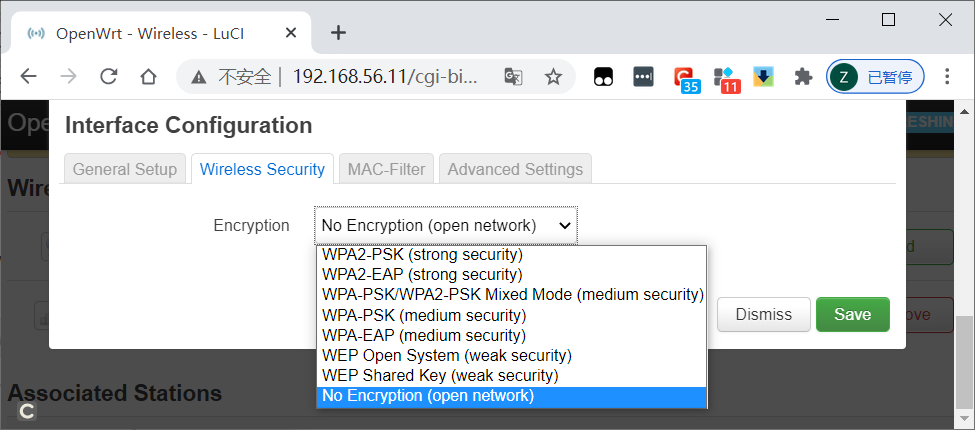

+ 查看AP/无线路由器支持哪些工作模式

  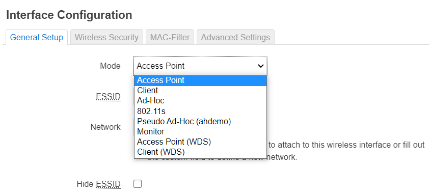

## 实验步骤


### 安装`openwrt`
-  将`VBoxManage.exe`的路径添加到系统环境变量；
-  下载[wget.exe](https://eternallybored.org/misc/wget/)并将其放到`git`的`mingw64\bin`目录下。

```bash
# 下载镜像文件
wget -q https://downloads.openwrt.org/releases/19.07.5/targets/x86/64/openwrt-19.07.5-x86-64-combined-squashfs.img.gz

# 解压缩
gzip -d openwrt-19.07.5-x86-64-combined-squashfs.img.gz

# 重新整合镜像
dd if=openwrt-19.07.5-x86-64-combined-squashfs.img of=lede.img bs=128000 conv=sync

# img 格式转换为 Virtualbox 虚拟硬盘格式 vdi
VBoxManage convertfromraw --format VDI lede.img openwrt-x86-64-combined-squashfs.vdi

# 磁盘扩容
VBoxManage modifymedium disk --resize 10240  openwrt-x86-64-combined-squashfs.vdi

# 新建虚拟机选择「类型」 Linux / 「版本」Linux 2.6 / 3.x / 4.x (64-bit)，填写虚拟机名称

# 内存设置为 256 MB

# 使用已有的虚拟硬盘文件 - 「注册」新虚拟硬盘文件选择刚才转换生成的 .vdi 文件

# 配置双网卡 第一块网卡设置为：Intel PRO/1000 MT 桌面（仅主机(Host-Only)网络）第二块网卡设置为：Intel PRO/1000 MT 桌面（网络地址转换(NAT)）

# 将虚拟硬盘文件设置为多重加载

# USB设备选择USB 3.0 (xHCI)控制器

# 启动虚拟机，黑色命令行界面不再滚动更新新消息时，按下「ENTER」键即可进入 OpenWrt 的终端控制台。
```

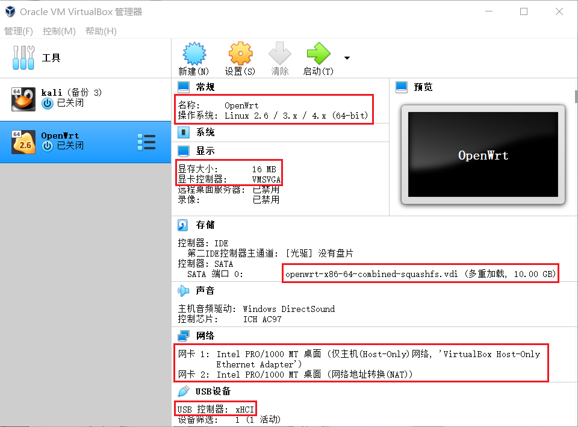

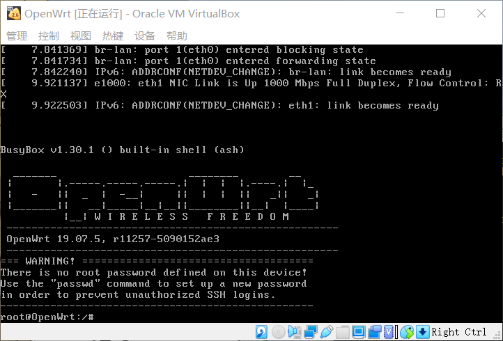

-  `OpenWrt`配置

   通过 `vi` 直接编辑 `/etc/config/network` 配置文件来设置好远程管理专用网卡的 IP 地址。修改 `OpenWrt` 局域网地址为当前 Host-only 网段内可用地址，只需要修改 `option ipaddr` 的值即可。然后重启系统以使新的网络配置生效。

  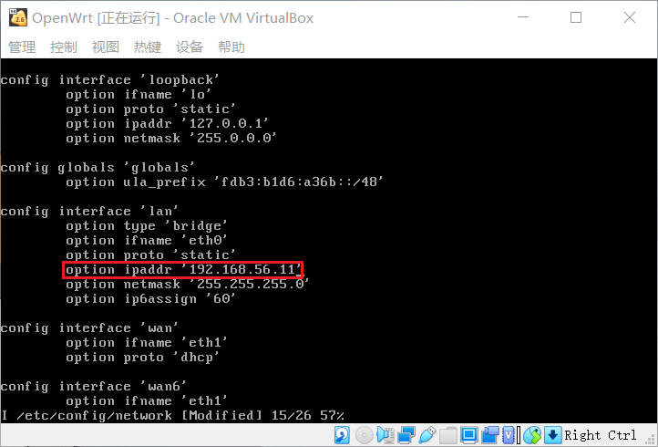

-  `LuCi`软件包安装
  
  ```bash

  # 更新 opkg 本地缓存
  opkg update
  
  # 安装 luci
  opkg install luci
  
  # 安装好 luci 后通过浏览器访问管理 OpenWrt 
  ```

  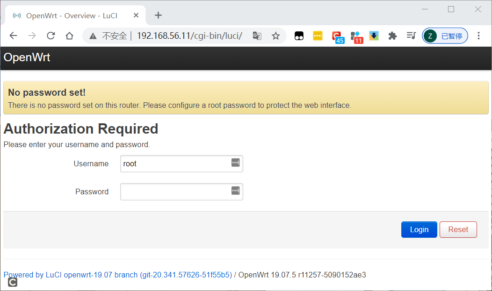

### 开启AP功能

  ```bash
  # 安装对应的软件包以使用 lsusb 命令 
  opkg update && opkg install usbutils

  # 使用 lsusb 命令检查网卡驱动
  lsusb
  
  lsusb -t
  
  
 
  ```
- 截图可以看出芯片名称为 AR9271 的无线网卡未加载到匹配的驱动
  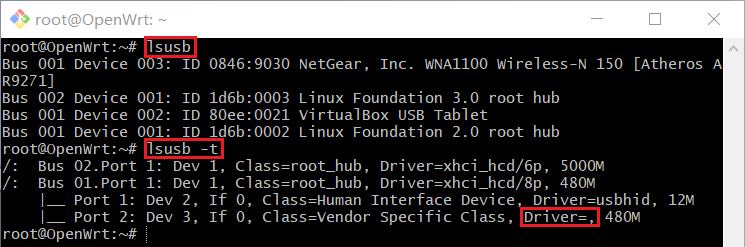
  

  ```bash
  #通过opkg find 命令快速查找可能包含指定芯片名称的驱动程序包
  opkg find kmod-* | grep 9271
  
  #安装上述查询出的驱动
  opkg install kmod-ath9k-htc


  ```
- 安装完成后检查驱动，通过下面的截图可以看出驱动已加载
  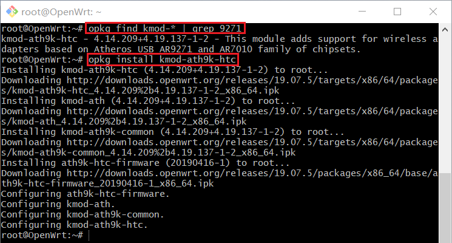

  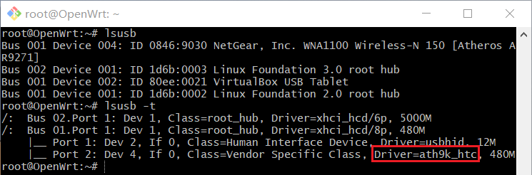
  
+ 安装`wpa-supplicant` 和 `hostapd`。
  
    为了让```openwrt```支持更安全的无线安全机制，还需安装```wpa-supplicant```(提供 WPA 客户端认证) 和 ```hostapd``` (提供 AP 或 ad-hoc 模式的 WPA 认证)。

  ```bash
 
  opkg install hostapd wpa-supplicant
  ```

  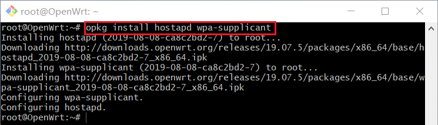

+ 重启系统使配置生效。能在网页版的`Network`下拉菜单中看见新的菜单项`Wireless`。

  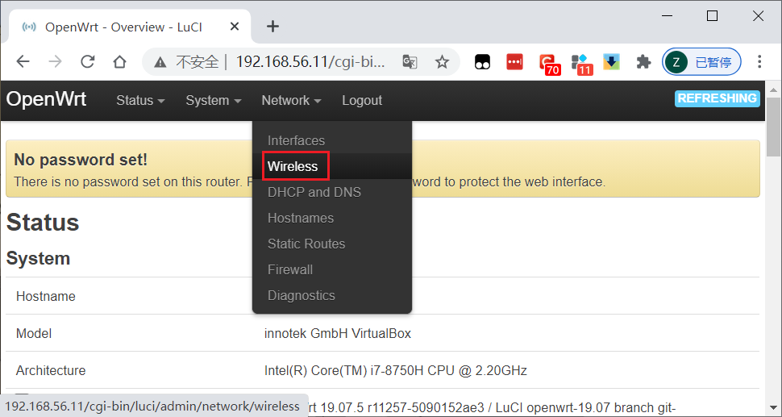

+ 进行下述的配置以便其他无线客户端可以正确发现新创建的无线网络:

  + 无线网络的详细配置界面里的 `Interface Configuration` 表单里 `Network` 勾选 `wan` ；
  + 虚拟机的 WAN 网卡对应的虚拟网络类型必须设置为 `NAT` 而不能使用 `NatNetwork` 。无线客户端连入无线网络后才可以正常上网。
  + 不要使用 Auto 模式的信道选择和信号强度，均手工指定才可以。

    

+ 完成无线网络配置之后，需要点击 `Enable` 按钮启用当前无线网络。下图已点击`Enable`按钮，目前无设备连接。

  

+ Wireless Scan
  
  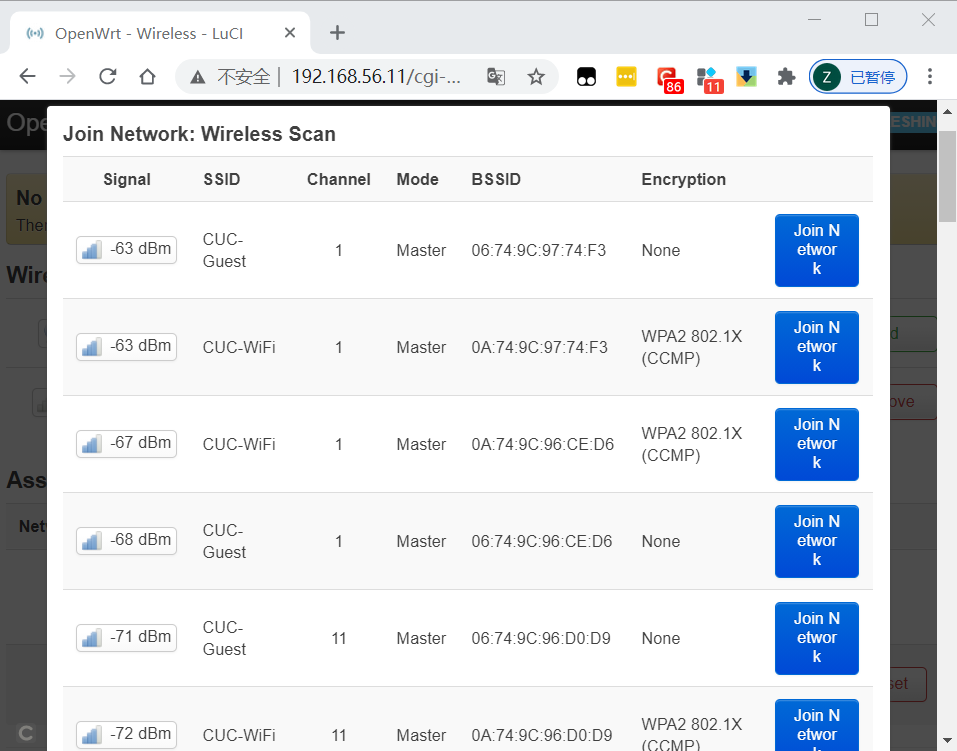

+ 手机连接之后

  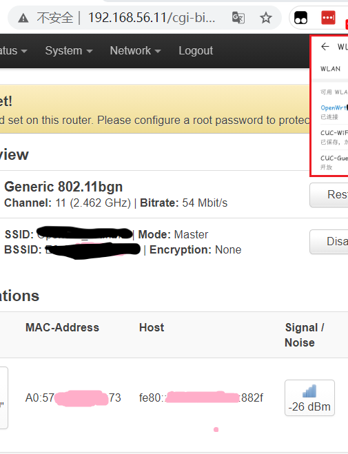


## 遇到的问题

暂无，还挺顺利滴

## 参考资料

+ [第一章 无线网络安全基础](https://c4pr1c3.github.io/cuc-mis/chap0x01/exp.html)
+ [在Virtualbox虚拟机中运行OpenWrt](https://openwrt.org/zh/docs/guide-user/virtualization/virtualbox-vm)
