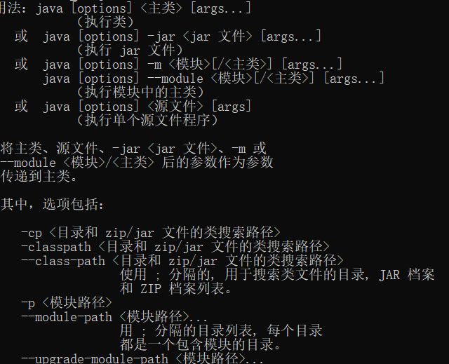
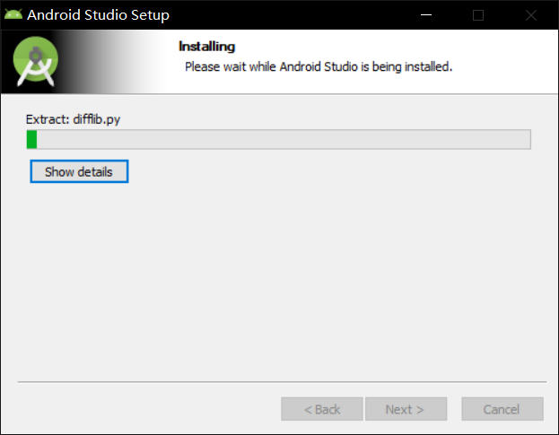
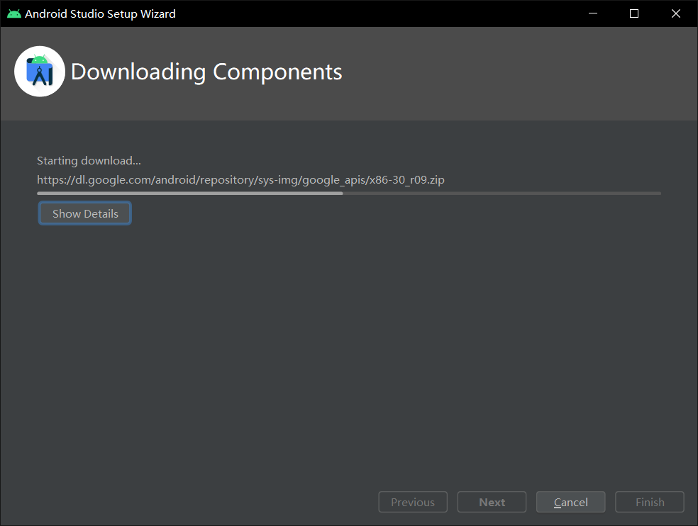
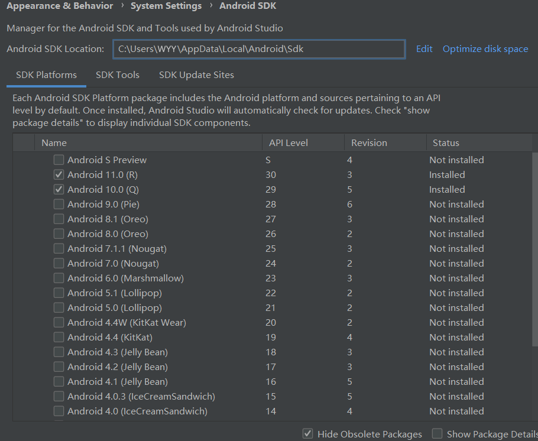
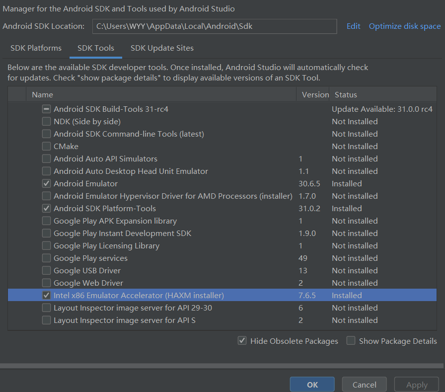
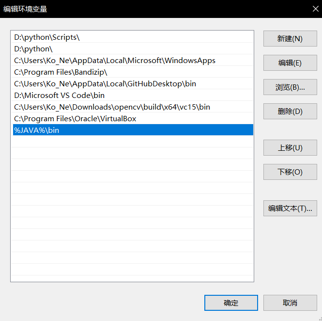

# 安装Android Studio

## 实验要求
- [x] 安装和配置Java SDK
- [x] 安装Android Studio
- [x] 下载安装Android SDK
- [x] 配置Android模拟器运行环境
- [x] 配置Gradle编译环境

## 实验环境

- Windows 10

- Android Studio

## 实验过程

### 1、安装Java SDK
- [java官网](https://developer.oracle.com/java/)下载并安装java11
  

### 2、下载安装Android Studio

-  通过官方网站下载[Android Studio](https://developer.android.com/studio/)最新版本并根据提示安装。  

### 3、下载安装 Android SDK

- 在启动 Android Studio 之后可以在Android SDK选项卡中选择不同版本的Android SDK进行下载，本机自带Android 11，自行下载的Android 10。  
  

### 配置 Android 模拟器运行环境

- 安装 `Intel x86 Emulator Accelerator (HAXM installer)`

  

### 在 Android 模拟器上运行应用

- 创造一个虚拟设备  

## 遇到的问题
- JAVA成功安装后用不了T T研究之后发现需要手工添加环境变量……手动添加后能够正常使用。  

## 参考资料

- [第五章 智能操作系统安全基础](https://c4pr1c3.github.io/cuc-mis/chap0x05/exp.html)

- [Android 官方文档](https://developer.android.com/studio/run/emulator)
