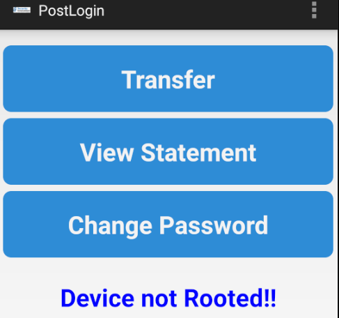
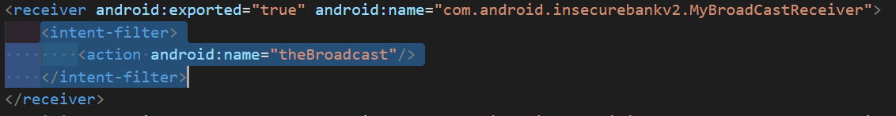

# 实验八 Android 缺陷应用漏洞攻击实验

## 实验目的

- 理解 Android 经典的组件安全和数据安全相关代码缺陷原理和漏洞利用方法

- 掌握 Android 模拟器运行环境搭建和 `ADB` 使用
---

## 实验环境

- Android-InsecureBankv2

- Android Studio Arctic Fox | 2020.3.1 Beta 4

- Python 2.7
---

## 实验要求

- [x] 详细记录实验环境搭建过程；

- [x] 至少完成以下实验：

    - [x] Developer Backdoor
    - [x] Insecure Logging
    - [x] Android Application patching + Weak Auth
    - [x] Exploiting Android Broadcast Receivers
    - [x] Exploiting Android Content Provider
- [x] （可选）使用不同于 Walkthroughs 中提供的工具或方法达到相同的漏洞利用攻击效果；
    - 推荐 drozer

---

## 实验内容

### 1、搭建实验环境

  - 下载python2.7.18
  - 安装必备软件
    ```bash
    #安装python所需的库
    pipenv install -r requirements.txt --two
    pipenv shell
    pip freeze
    ```
   
    

- 安装InsecureBank.apk,启动客户端,完成配置

    ```bash
    adb install InsecureBankv2.apk
    ```

  
   
  

  

- 运行 python 服务器

   ```bash
    python2 app.py
   ```

  

- 登录

  使用 `jack/Jack@123$` 或`dinesh/Dinesh@123$` 即可登陆成功
    
  

---


### 2、实验过程及结果
#### (1)Developer Backdoor

- 找漏洞

    

- 利用漏洞

    

    

---

#### (2)Insecure Logging

- 打开日志

    ```bash
    adb logcat
    ```

 - 找到漏洞
    

 - 利用漏洞

   进入修改密码界面，将密码修改为 `Jack@123！` ，利用日志查看

    

---

#### (3)Android Application patching + Weak Auth

- 反编译

    

- 找到并利用漏洞 
  + `InsecureBankv2/res/values` 中找到 `strings.xml` ，将`is—_admin`的值改为`yes`

    


  + 重新打包

    

  + 重新安装 `InsecureBankv2.apk` ，增加可以创建新用户的按钮

    

---

#### (4)Exploiting Android Broadcast Receivers

- 反编译

- 提前下载 `dex2jar` 和 `JADX`

- 找到漏洞

   在 `AndroidManifest.xml` 文件，找到

    

- 利用漏洞
  + 对 `InsecureBankv2.apk` 进行逆向操作
    ```bash
    unzip InsecureBankv2.apk

    #将classes.dex文件复制到dex2jar文件夹
    chmod +x d2j-dex2jar.sh
    chmod +x d2j_invoke.sh

    d2j-dex2jar.bat classes.dex
    ```


  +  打开 `jar` 文件，找到 `com.android.insecurebankv2.ChangePassword` 和 `com.android.insecurebankv2.MyBroadCastReceiver` 中的代码：

     

     

  + 将 `InsecureBankv2.apk` 复制到 `Android SDK` 的 `platform-tools` 文件夹下，在模拟器运行时，执行以下命令：

    ```bash
    adb install InsecureBankv2.apk
    ```

  + 再次打开 `InsecureBankv2`并回到 `platform-tools` 文件夹，命令行执行以下命令：

    ```bash
    adb shell am broadcast -a theBroadcast -n com.android.insecurebankv2/com.android.insecurebankv2.MyBroadCastReceiver --es phonenumber 5554 –es newpass Dinesh@123!
    ```

    

  - 收到短信
  

---

#### (5)Exploiting Android Content Provider

- 反编译
- 找到漏洞 
 
   `AndroidManifest.xml` 文件中的代码：

    

- 利用漏洞
  + 逆向操作，用 `JADX` 直接打开 `jar` 文件，找到代码

    

  + 将 `InsecureBankv2.apk` 复制到 `Android SDK` 的 `platform-tools` 文件夹下，在模拟器运行时，执行以下命令：

    ```bash
    adb install InsecureBankv2.apk
    ```

  + 再次打开 `InsecureBankv2`，回到 `platform-tools` 文件夹并在命令行执行以下命令：

    ```bash
    adb shell content query --uri content://com.android.insecurebankv2.TrackUserContentProvider/trackerusers
    ```

  + 得到记录如下

    


---
#### (6) Drozer漏洞利用攻击

- 环境配置

  + 下载文件：https://github.com/mwrlabs/drozer

  + 下载手机Agent并安装：https://github.com/mwrlabs/drozer/releases/download/2.3.4/drozer-agent-2.3.4.apk

    ```bash
    adb install drozer-agent-2.3.4.apk
    ```

    

- 启动dozer 


    ```bash
    #转发端口
    adb forward tcp:31415 tcp:31415
    #连接控制器
    drozer console connect
    ```

- 连接成功

    

- 使用drozer实现xploiting Android Content Provider


   

---

## 实验问题


- 进行Exploiting Android Broadcast Receivers实验，执行`sh d2j-dex2jar.sh classes.dex` 时报错

    - 解决办法：换成 `d2j-dex2jar.bat classes.dex`就好了


---

## 参考资料

- [第八章实验](https://c4pr1c3.github.io/cuc-mis/chap0x08/homework.html)

- [移动互联网安全（2021）](https://www.bilibili.com/video/BV1rr4y1A7nz?p=162)

- [Android 必知必会 - 使用 ADB 操作 Clipboard](https://blog.csdn.net/ys743276112/article/details/79083798)


